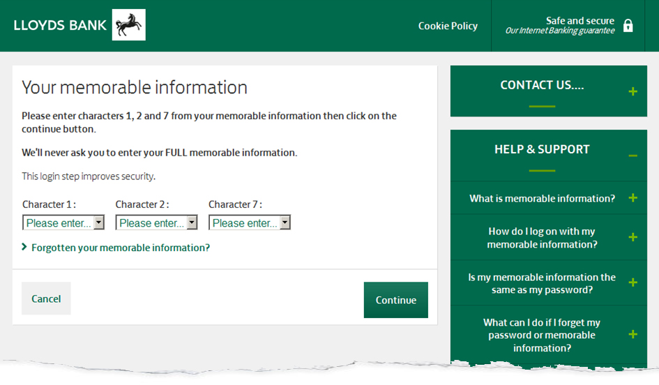
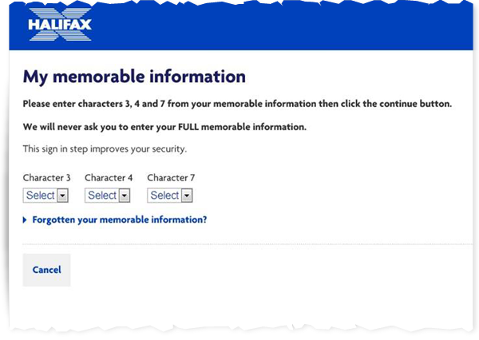
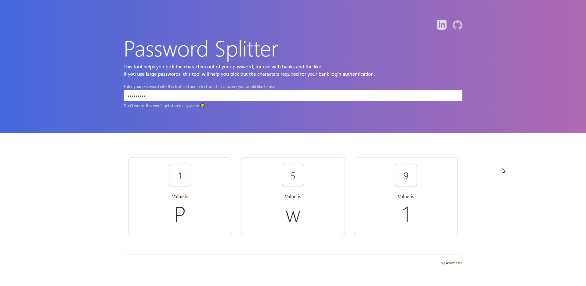

# Password Splitter
     

A quick and easy tool to split passwords up and quickly identify the position of characters in your passwords.

[View On GitHub Docs](https://axemasta.github.io/Password-Splitter/)

I built this tool because I use a popular password manager and love to generate stupidly long passwords. When logging into different websites I get prompted for different characters of my passwords. Unfortunately for me when your password is stupidly long it means counting all the characters and getting it wrong half the time. I built this little app to do the dirty work for me!

Built for pesky little pages like this

| Your Bank                                    | Your ... Bank 😅                               |
| -------------------------------------------- | --------------------------------------------- |
|  |  |

## Usage

All you need to do is put the password you want to analyse into the text field at the top. Next simply type the number of the character you wish to see and it will be displayed in the box.

*Here is an example for the extremely secure password **Password1***

## License

[MIT](LICENSE)